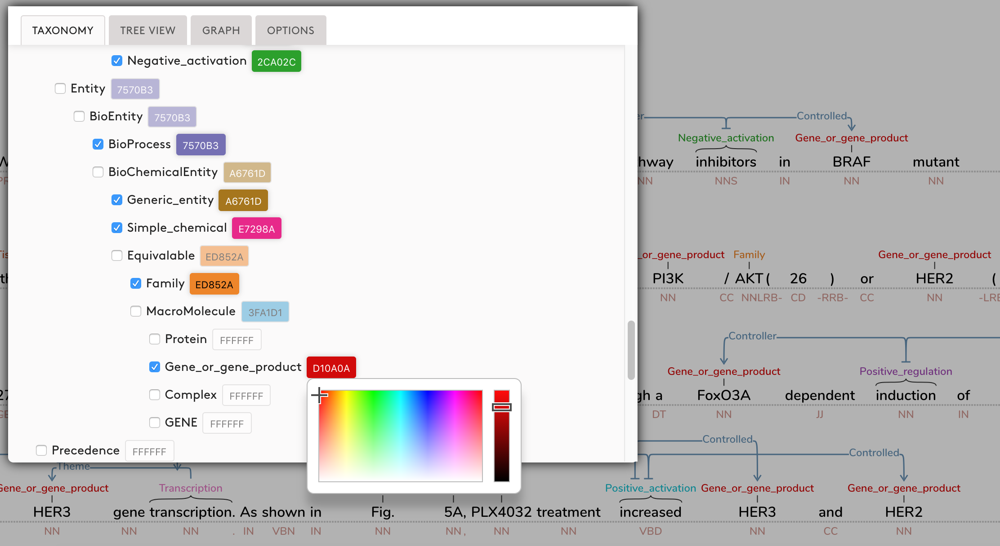

# TextAnnotationGraphs (TAG)
A modular annotation system that supports complex, interactive annotation graphs embedded on top of sequences of text. An additional view displays a subgraph of selected connections between words/phrases using an interactive network layout.


---



---


---


## Development
TAG was developed by Angus Forbes (UC Santa Cruz) and Kristine Lee (University of Illinios at Chicago), in collaboration with Gus Hahn-Powell, Marco Antonio Valenzuela Escárcega, Zechy Wong, and Mihai Surdeanu (University of Arizona). Contact angus@ucsc.edu for more information.

# Citing TAG

If you use TAG in your work, please use the following citation:

```
@inproceedings{TAG-2018,
    author = {Angus Forbes and Kristine Lee and Gus Hahn-Powell and Marco A. Valenzuela-Escárcega and Mihai Surdeanu},
    title = {Text Annotation Graphs: Annotating Complex Natural Language Phenomena},
    booktitle = {Proceedings of the Eleventh International Conference on Language Resources and Evaluation (LREC'18)},
    year = {2018},
    month = {May},
    date = {7-12},
    address = {Miyazaki, Japan},
    editor = {Sara Goggi and Hélène Mazo},
    publisher = {European Language Resources Association (ELRA)},
    language = {english}
}
```

## Write-up
A paper describing TAG was accepted to [LREC'18](http://lrec2018.lrec-conf.org/en/conference-programme/accepted-papers/). A pre-print can be found at [https://arxiv.org/abs/1711.00529](https://arxiv.org/abs/1711.00529)

## Installation

TAG can be built and installed using [`npm`](https://docs.npmjs.com/getting-started/installing-node).

### Via `npm`

```
npm install git+https://github.com/CreativeCodingLab/TextAnnotationGraphs.git
```

## Usage

To use TAG with your own applications, first include the library in your script:

#### Browserify (CommonJS)

```
const TAG = require("text-annotation-graphs");
```

#### ES6

```
import TAG from "text-annotation-graphs";
```

Then initialise the visualisation on an element, optionally specifying the initial data set to load and any overrides to the default options.  For more details, consult the full API documentation.

```
const graph = TAG.tag({
  container: $container,
  data: {...},
  format: "odin",
  options: {...}
});
```

## Development

Tasks are managed via [`npm` scripts](https://docs.npmjs.com/misc/scripts) and the [`runjs` build tool](https://github.com/pawelgalazka/runjs).  The most commonly used tasks are listed in `package.json`, and details for the various sub-tasks can be found in `runfile.js`.

### Demo

After cloning the repository and installing the project dependencies via `npm install`, you can run the interactive demo using `npm run demo` and directing your browser to `localhost:8080`.

To run the demo on a different port, set the `PORT` environmental variable. For example, running `PORT=9000 npm run demo` will start the demo server on `localhost:9000` instead.


### Building the source

TAG is written in ES6, and uses [Sass](https://sass-lang.com/) for its styles.

Assuming you've cloned the repository, simply run `npm install && npm run build` to install dependencies and transpile the source to ES2015.

### Live monitoring of changes

For convenience, you can monitor changes to the library's sources (css + js) with the following `npm` task: 

```
npm run watch
```

### Generating documentation

TAG uses [JSDoc](http://usejsdoc.org/) to generate its documentation. By default, the documentation is generated using the template in `src/jsdoc-template` (adapted from the [Braintree JSDoc Template](https://github.com/braintree/jsdoc-template)) and stored in the `docs` folder.

To regenerate the documentation, use the following `npm` task:

```
npm run generate-docs
``` 